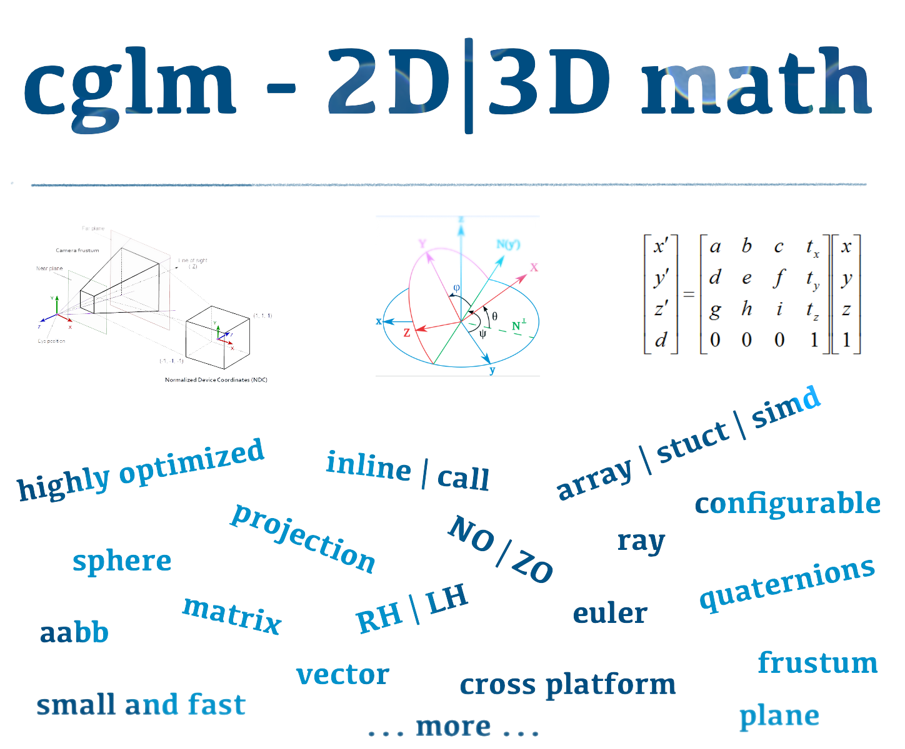

# 🎥 OpenGL Mathematics (glm) for `C`

<p align="center">
   
</p>
<br>
<p align="center">
    <a href="https://github.com/recp/cglm/actions/workflows/ci.yml">
        
    </a>
    <a href="http://cglm.readthedocs.io/en/latest/?badge=latest">
        
    </a>
    <a href="https://www.codacy.com/app/recp/cglm?utm_source=github.com&amp;utm_medium=referral&amp;utm_content=recp/cglm&amp;utm_campaign=Badge_Grade">
        
    </a>
    <a href="https://coveralls.io/github/recp/cglm?branch=master">
        
    </a>
    <a href="https://codecov.io/gh/recp/cglm">
        
    </a>
    <br /><br />
    <a href="#sponsors">
        
    </a>
    <a href="#backers">
        
    </a>
</p>

<br>

<p align="center">
A highly optimized 2D|3D math library. Also known as OpenGL Mathematics (glm) for C. <b>cglm</b> provides fast and ergonomic math functions to ease graphics programming. It is community friendly – feel free to report any bugs and issues you face. <br>
<i>If you're using C++, you might want to check out <a href="https://github.com/g-truc/glm">GLM</a></i>
</p>

 - Allocation-free
 - Header-only
 - SIMD-optimized
 - API-agnostic

---

### 📚 Documentation

All functions and their parameters are documented above their declaration inside their corresponding headers. <br />
Alternatively, you can read the complete documentation [here](http://cglm.readthedocs.io).

### 🔨 Building

cglm can be used in it's entirety as a header-only library simply by including `cglm/cglm.h`. If you wish to link against it instead, it can be built using one of the supported build systems. Detailed information about building on individual platforms and build systems along with the instructions for building the documentation can be found in [BUILDING.md](./BUILDING.md).

### ✅ Usage

#### Header-only

Include the `cglm/cglm.h` header and use functions with the `glm_` prefix.
```c
#include "cglm/cglm.h"

// ...

vec2 vector;
glm_vec2_zero(vector);
```

#### Struct API

Include `cglm/struct.h` and use `glms_`.
```c
#include "cglm/struct.h"

// ...

vec2s vector = glms_vec2_zero();
```

#### Linked

Include `cglm/call.h` and use `glmc_`.
```c
#include "cglm/call.h"

// ...

vec2 vector;
glmc_vec2_zero(vector);
```

### ❗ Alignment

While cglm by default aligns what's necessary, it is possible to disable this by defining `CGLM_ALL_UNALIGNED`. If you're targeting machines with any kind of SIMD support, make sure that all `vec4`, `mat4` and `mat2` arguments you pass to cglm functions are aligned to prevent unexpected crashes, alternatively use the unaligned versions if present. 

### Struct API

The struct API works as follows (note the `s` suffix on types, `glms_` prefix on functions and `GLMS_` on constants):

```C
#include <cglm/struct.h>

mat4s mat = GLMS_MAT4_IDENTITY_INIT;
mat4s inv = glms_mat4_inv(mat);
```

Struct functions generally take parameters *by copy* and *return* the results rather than taking pointers and writing to out parameters. That means your variables can usually be `const`, if you're into that.

The types used are actually unions that allow access to the same data in multiple ways. One of these involves anonymous structures available since C11. MSVC supports them in earlier versions out of the box and GCC/Clang as well if you enable `-fms-extensions`.
To explicitly enable anonymous structures `#define CGLM_USE_ANONYMOUS_STRUCT 1`, or `0` to disable them.
For backwards compatibility, you can also `#define CGLM_NO_ANONYMOUS_STRUCT` to disable them. If you don't specify explicitly, cglm will attempt a best guess based on your compiler and C version.

### 📌 Migration notes:

- `_dup` (duplicate) functions were renamed to `_copy`. For instance: `glm_vec_dup` -> `glm_vec3_copy`.
- OpenGL related functions were dropped to make cglm API independent.
- **[bugfix]** Euler angles had been previously implemented in reverse order (extrinsic). This was fixed to be intrinsic.
- **[major change]** Starting with **v0.4.0**, quaternions are stored as [x, y, z, w]. Previously it was [w, x, y, z].
- **[api rename]** Starting with **v0.4.5**, `glm_simd_` functions are renamed to `glmm_`.
- **[new option]** Starting with **v0.4.5**, alignment requirements can be disabled. Read more in the documentation.  
- **[major change]** Starting with **v0.5.0**, vec3 functions occupy the **glm_vec3_** namespace. This used to be **glm_vec_** in earlier versions.
- **[major change]** Starting with **v0.5.1**, `vec3` and `mat3` types are not aligned by default.
- **[major change]** Starting with **v0.7.3**, inline print functions are disabled by default in release mode to eliminate printing costs (see the Options chapter of the docs). <br> Colored output can be disabled (see documentation).
- **[major change]** Starting with **v0.8.3**, alternate clipspace configurations are supported. The `CGLM_FORCE_DEPTH_ZERO_TO_ONE` and `CGLM_FORCE_LEFT_HANDED` flags are provided to control clip depth and handedness. This makes it easier to incorporate cglm into projects using graphics APIs such as Vulkan or Metal. See https://cglm.readthedocs.io/en/latest/opt.html#clipspace-option-s

### 🚀 Features

- scalar and simd (sse, avx, neon...) optimizations
- general purpose matrix operations (mat4, mat3)
- chain matrix multiplication (square only)
- general purpose vector operations (cross, dot, rotate, proj, angle...)
- affine transformations
- matrix decomposition (extract rotation, scaling factor)
- optimized affine transform matrices (mul, rigid-body inverse)
- camera (lookat)
- projections (ortho, perspective)
- quaternions
- euler angles / yaw-pitch-roll to matrix
- extract euler angles
- frustum (extract view frustum planes, corners...)
- bounding box (AABB in Frustum (culling), crop, merge...)
- bounding sphere
- project, unproject
- easing functions
- curves
- curve interpolation helpers (SMC, deCasteljau...)
- comversion helpers from cglm types to Apple's simd library to pass cglm types to Metal GL without packing them on both sides
- ray intersection helpers
---

<table>
  <tbody>
    <tr>
      <td>
        <div>Like other graphics libraries (especially OpenGL), cglm uses column-major layout to keep matrices in memory. </div>
        <div>&nbsp;</div>
        <div>While we might support row-major matrices in the future, currently if you need your matrices to be in row-major layout you have to transpose them. </div>
      </td>
      <td>
        
      </td>
    </tr>
  </tbody>
</table>

---

cglm contains general purpose mat4 product and inverse functions but also provides optimized versions for affine transformations. If you want to multiply two affine transformation matrices you can use glm_mul instead of glm_mat4_mul and glm_inv_tr (ROT + TR) instead glm_mat4_inv.
```C
/* multiplication */
mat4 modelMat;
glm_mul(T, R, modelMat);

/* othonormal rot + tr matrix inverse (rigid-body) */
glm_inv_tr(modelMat);
```

## Contributors

This project exists thanks to all the people who contribute. [[Contribute](CONTRIBUTING.md)]
<a href="https://github.com/recp/cglm/graphs/contributors"></a>


## Backers

Thank you to all our backers! 🙏 [[Become a backer](https://opencollective.com/cglm#backer)]

<a href="https://opencollective.com/cglm#backers" target="_blank"></a>


## Sponsors

Support this project by becoming a sponsor. Your logo will show up here with a link to your website. [[Become a sponsor](https://opencollective.com/cglm#sponsor)]

<a href="https://opencollective.com/cglm/sponsor/0/website" target="_blank"></a>
<a href="https://opencollective.com/cglm/sponsor/1/website" target="_blank"></a>
<a href="https://opencollective.com/cglm/sponsor/2/website" target="_blank"></a>
<a href="https://opencollective.com/cglm/sponsor/3/website" target="_blank"></a>
<a href="https://opencollective.com/cglm/sponsor/4/website" target="_blank"></a>
<a href="https://opencollective.com/cglm/sponsor/5/website" target="_blank"></a>
<a href="https://opencollective.com/cglm/sponsor/6/website" target="_blank"></a>
<a href="https://opencollective.com/cglm/sponsor/7/website" target="_blank"></a>
<a href="https://opencollective.com/cglm/sponsor/8/website" target="_blank"></a>
<a href="https://opencollective.com/cglm/sponsor/9/website" target="_blank"></a>
