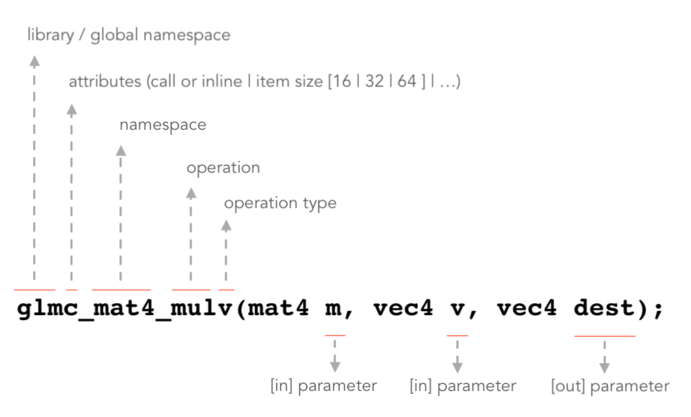

Getting Started
================================

Types:
~~~~~~~~~~~~~~~~~~~~~~~~~~~~~~~~~~~~~~~~~~~~~~~~~~~~~~~~~~~~~~~~~~~~~~~~~~~~~~~~

**cglm** uses **glm** prefix for all functions e.g. glm_lookat. You can see supported types in common header file:

.. code-block:: c
  :linenos:

  typedef float                   vec2[2];
  typedef float                   vec3[3];
  typedef int                    ivec3[3];
  typedef CGLM_ALIGN_IF(16) float vec4[4];
  typedef vec4                    versor;
  typedef vec3                    mat3[3];

  #ifdef __AVX__
  typedef CGLM_ALIGN_IF(32) vec4  mat4[4];
  #else
  typedef CGLM_ALIGN_IF(16) vec4  mat4[4];
  #endif

As you can see types don't store extra informations in favor of space.
You can send these values e.g. matrix to OpenGL directly without casting or calling a function like *value_ptr*

Alignment Is Required:
~~~~~~~~~~~~~~~~~~~~~~~~~~~~~~~~~~~~~~~~~~~~~~~~~~~~~~~~~~~~~~~~~~~~~~~~~~~~~~~~

**vec4** and **mat4** requires 16 (32 for **mat4** if AVX is enabled) byte alignment because **vec4** and **mat4** operations are vectorized by SIMD instructions (SSE/AVX/NEON).

**UPDATE:**
  By starting v0.4.5 cglm provides an option to disable alignment requirement, it is enabled as default

  | Check :doc:`opt` page for more details

  Also alignment is disabled for older msvc verisons as default. Now alignment is only required in Visual Studio 2017 version 15.6+ if CGLM_ALL_UNALIGNED macro is not defined.

Allocations:
~~~~~~~~~~~~~~~~~~~~~~~~~~~~~~~~~~~~~~~~~~~~~~~~~~~~~~~~~~~~~~~~~~~~~~~~~~~~~~~~
*cglm* doesn't alloc any memory on heap. So it doesn't provide any allocator.
You must allocate memory yourself. You should alloc memory for out parameters too if you pass pointer of memory location. When allocating memory, don't forget that **vec4** and **mat4** require alignment.

**NOTE:** Unaligned **vec4** and unaligned **mat4** operations will be supported in the future. Check todo list.
Because you may want to multiply a CGLM matrix with external matrix.
There is no guarantee that non-CGLM matrix is aligned. Unaligned types will have *u* prefix e.g. **umat4**

Array vs Struct:
~~~~~~~~~~~~~~~~~~~~~~~~~~~~~~~~~~~~~~~~~~~~~~~~~~~~~~~~~~~~~~~~~~~~~~~~~~~~~~~~
*cglm* uses arrays for vector and matrix types. So you can't access individual
elements like vec.x, vec.y, vec.z... You must use subscript to access vector elements
e.g. vec[0], vec[1], vec[2].

Also I think it is more meaningful to access matrix elements with subscript
e.g **matrix[2][3]** instead of **matrix._23**. Since matrix is array of vectors,
vectors are also defined as array. This makes types homogeneous.

**Return arrays?**

Since C doesn't support return arrays, cglm also doesn't support this feature.

Function design:
~~~~~~~~~~~~~~~~~~~~~~~~~~~~~~~~~~~~~~~~~~~~~~~~~~~~~~~~~~~~~~~~~~~~~~~~~~~~~~~~

cglm provides a few way to call a function to do same operation.

* Inline - *glm_, glm_u*
* Pre-compiled - *glmc_, glmc_u*

For instance **glm_mat4_mul** is inline (all *glm_* functions are inline), to make it non-inline (pre-compiled),
call it as **glmc_mat4_mul** from library, to use unaligned version use **glm_umat4_mul** (todo).

Most functions have **dest** parameter for output. For instance mat4_mul func looks like this:

.. code-block:: c

   CGLM_INLINE
   void
   glm_mat4_mul(mat4 m1, mat4 m2, mat4 dest)

The dest parameter is out parameter. Result will be stored in **dest**.
Also in this case matrix multiplication order is dest = m1 * m2.

* Changing parameter order will change the multiplication order.
* You can pass all parameter same (this is similar to m1 `*=` m1), you can pass **dest** as m1 or m2 (this is similar to m1 `*=` m2)

**v** postfix in function names
-------------------------------

You may see **v** postfix in some function names, v stands for vector.
For instance consider a function that accepts three parameters x, y, z.
This function may be overloaded by **v** postfix to accept vector (vec3) instead of separate parameters.
In some places the v means that it will be apply to a vector.

**_to** postfix in function names
---------------------------------

*_to* version of function will store the result in specified parameter instead of in-out parameter.
Some functions don't have _to prefix but they still behave like this e.g. glm_mat4_mul.
